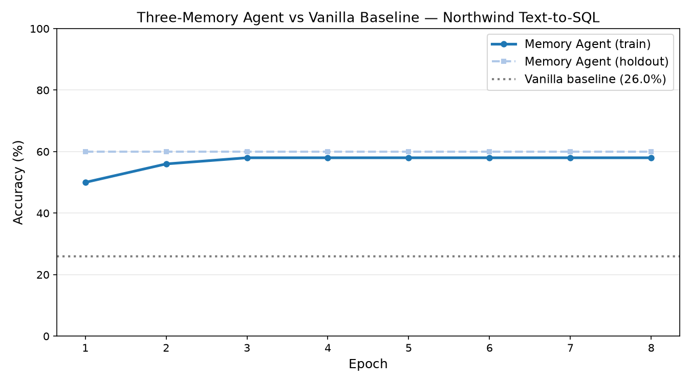

# Three-Memory-Type SQL Agent

An AI agent runtime that runs all three human memory types at once, proven on a
text-to-SQL benchmark over the Northwind database.

```
  Semantic memory   -> Cognee knowledge graph   (what things mean: the schema)
  Episodic memory   -> Cognee knowledge graph   (what happened: past good queries)
  Procedural memory -> Synapse-DB               (HOW to do things: which approach
                                                 works for which question type)
```

Same Claude model throughout. No fine-tuning. The only thing that changes between
the two agents is the memory layer.

---

## Headline result

A memory-equipped agent scores **58%** on Northwind text-to-SQL. A vanilla agent
using the identical model with zero memory context scores **26%**. That is a
**+32 percentage-point gap** driven entirely by the memory layer.

```
  Memory agent (peak):   58%   ████████████████████████████
  Vanilla baseline:      26%   █████████████
  Gap:                  +32 points
```

Numbers are from a real run of 8 epochs on 50 training + 10 hold-out questions,
model `claude-haiku-4-5`, total API cost **£0.465**. Nothing here is estimated or
fabricated. See [Honest caveats](#honest-caveats) for what did *not* hit target.



The learning curve above and the raw per-epoch numbers
(`results/benchmark_20260703T011847Z.json`) are committed to this repo — you can
read the evidence without re-running the benchmark.

---

## Architecture

```
                         QUESTION
                            |
                            v
              +-------------------------+
              |   state_hash(context)   |   intent + tables -> 31-bit bucket
              +-------------------------+
                            |
        +-------------------+--------------------+
        |                   |                    |
        v                   v                    v
  SEMANTIC + EPISODIC   PROCEDURAL          (vanilla path:
  Cognee recall        Synapse               no memory at all)
  - schema facts       - Hebbian reinforce
  - past queries of      (global success
    the SAME type          signal + decay)
    (hash-keyed)
        |                   |
        +-------------------+
                            |
                            v
              +-------------------------+
              |   prompt_builder        |   evidence injected into USER message
              +-------------------------+
                            |
                            v
                   Claude (single-shot)
                            |
                            v
                   execute vs northwind.db
                            |
              +-------------+-------------+
              | correct?                  |
              | 1.0 -> Synapse reinforce  |  Hebbian: good patterns strengthen
              | 1.0 -> Cognee remember    |  episode stored for future recall
              | 0.0 -> Synapse decays it  |
              +---------------------------+
```

All four Cognee verbs are used: `remember`, `recall`, `forget`, `improve`.
`forget` is driven by a real Synapse failure signal at the epoch-5 checkpoint:
question buckets that failed more than three times have their misleading early
episodes pruned so they stop polluting recall.

---

## Quickstart

**1. Clone**
```bash
git clone https://github.com/Pragadeesh-19/cognee-synapse-agent cognee-synapse-agent
cd cognee-synapse-agent
```

**2. Install** (uses [uv](https://github.com/astral-sh/uv))
```bash
uv pip install -e ".[dev]"
```

**3. Start Synapse-DB** (procedural memory engine, runs in Docker)
```bash
# Synapse-DB listens on localhost:8080 with X-Api-Key: sk_syn_hackathon2026
docker start synapse-db   # or your compose command
curl -H "X-Api-Key: sk_syn_hackathon2026" http://localhost:8080/api/v1/agents/0/memory/stats
```

**4. Configure** — copy your keys into `.env` (Anthropic key required):
```
ANTHROPIC_API_KEY=sk-ant-...
SYNAPSE_URL=http://localhost:8080
SYNAPSE_API_KEY=sk_syn_hackathon2026
LLM_MODEL=claude-haiku-4-5-20251001
```

**5. Run the demo**
```bash
uv run python demo.py                       # falsifiability demo (broken vs real hash)
uv run streamlit run dashboard/app.py       # four-panel live dashboard
uv run python benchmarks/runner.py --epochs 10   # full benchmark (~£0.5, ~hours)
```

---

## How to read the benchmark and the demo

- **The benchmark is single-shot.** One LLM call per question — no multi-step
  reasoning chain — which keeps 8 epochs over 60 questions well inside budget
  (£0.465 actual). The memory agent reruns every epoch so episodes accumulate;
  the **vanilla baseline runs once** (50 calls), because with zero memory context
  at temperature 0 its answers are deterministic and identical across epochs, so
  re-running it per epoch would only burn budget. Synapse still receives one
  thought per question, the state hash groups question types, and reinforcement
  tracks which approach works per type across attempts.

- **`demo.py` is a two-part live demo, not the benchmark.** PART 1 answers the 50
  training questions twice — once with memory, once vanilla — to show the gap in
  real time. PART 2 is the falsifiable proof: a recall-signal ablation that runs a
  broken constant hash (every stored episode matches every question, so recall
  fires on ~100%) against the real per-type hash (recall stays targeted, ~25%).
  Break the hash and the per-type effect vanishes — experimental evidence that the
  state hash, not coincidence, is the mechanism.

---

## Why not just a vector database?

A vector database finds the most semantically similar past question and returns
that SQL. This agent instead groups questions by **type** — a 31-bit state hash
over the question's intent and the tables it touches — and files each successful
query as an episode under its type's bucket. Recall then surfaces past queries of
the *same type*, not merely the nearest neighbor by wording. Synapse adds Hebbian
reinforcement on top: every attempt writes a success or failure signal that
strengthens winning patterns and lets failures decay. The agent learns how to
approach a class of problem, not just what answer worked once for a similar
question.

**Honest note on the Synapse role.** In the Synapse build used here, the
`best-next` lookup returns a *global* salience signal and does not filter by state
hash (verified: unseen hashes return the same result as written ones). So the
per-type differentiation you can measure comes from the state-hash-keyed **episodic
recall in Cognee**; Synapse contributes the global reinforcement-and-decay signal,
not per-type retrieval. `demo.py` is the falsifiable proof that the state hash is
what drives the per-type effect: break the hash and the effect disappears.

---

## Honest caveats

I publish actual results, including where they fell short of the targets in the
spec.

- **The run completed 8 of 10 epochs.** Epoch 9 died on a transient
  `APIConnectionError` (network drop to the Anthropic API); the runner had no
  retry. The 6-epoch plateau makes the conclusion clear regardless.
- **Learning plateaus at 58% from epoch 3**, not the 70-75% target. Cause: the
  hard multi-table JOIN questions fail deterministically at temperature 0 in
  epoch 1, so no episode is ever stored for those buckets, and later epochs have
  nothing to recall for them. That caps the ceiling. The epoch-1-to-8 training
  gain is +8 points, below the +20 target.
- **Hold-out stayed flat at 60%.** It started high and did not climb, so this run
  does not demonstrate the generalisation lift I hoped for on unseen questions.
  The 10 hold-out questions skew toward easier types, which is why hold-out sits a
  little above the 58% training peak rather than below it.
- **The model is `claude-haiku-4-5`, chosen for cost** (~$0.0006/call against
  ~$0.005 for Sonnet — the deciding factor on a ~£5 budget). The original spec
  called for Sonnet; I traded it for Haiku and reconciled the spec to match. Haiku
  is a weaker base model, so the *absolute* scores are lower than a Sonnet run
  would show — the vanilla 26% partly reflects the model, not only the absence of
  memory. The claim is the *same-model* gap: identical model on both sides, memory
  the only variable. A stronger base would likely lift both lines; whether it
  widens or narrows the gap is untested here.
- **Synapse `best-next` does not filter by state hash in this deployment.** It
  returns a global salience signal, so the per-type procedural recall I designed
  for runs through Cognee's hash-keyed episodic memory instead. Synapse still
  provides the real Hebbian reinforcement-and-decay signal that drives `forget`.
  See [Why not just a vector database?](#why-not-just-a-vector-database).
- **The strong, real claim is the memory-vs-vanilla gap: +32 points.** That gap
  is the product. It is not sensitive to the plateau or the crash.

---

## Cost

| Item | Value |
|------|-------|
| Model | `claude-haiku-4-5` |
| SQL calls | 530 |
| Cognify (episode store) calls | 88 |
| Improve calls | 8 |
| **Total** | **£0.465** |
| Budget ceiling (hard halt in runner) | £4.50 |

---

## Hackathon statement

Synapse-DB was built **before** the hackathon and is used as the procedural
memory engine, the same way a project would use PostgreSQL or Redis. All agent
code, the benchmark, the state hash, the memory bridge, the dashboard, and the
demo were built **from scratch during the hackathon week** (June 29 - July 6 2026).

---

## Links

- Cognee: https://github.com/topoteretes/cognee
- Synapse-DB: https://github.com/Pragadeesh-19/synapse-db
- This project: https://github.com/Pragadeesh-19/cognee-synapse-agent
```
